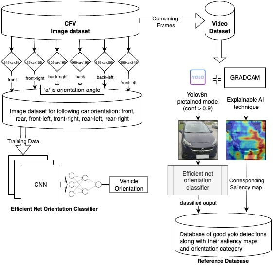
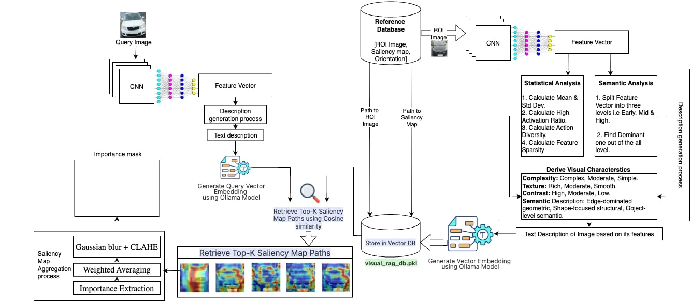
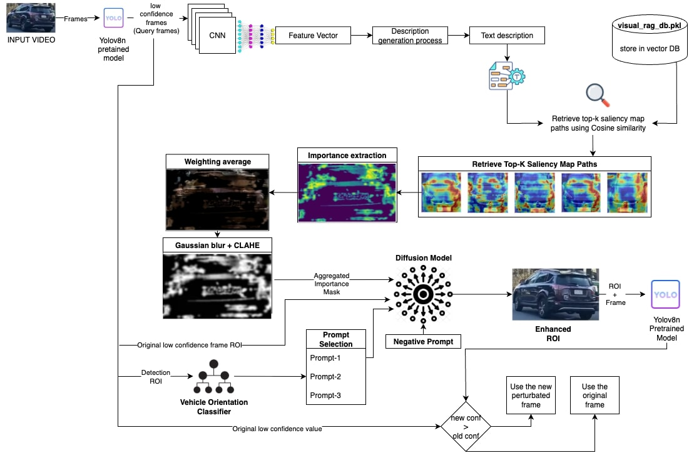

# XAI_guided_diffusion_for_detection

A novel diffusion-based pipeline guided by explainable AI to boost low-confidence vehicle detections without model retraining.

## Enhancing Low-Confidence Object Detection via XAI-Guided Inpainting

This project enhances low-confidence object detections in real-time without the need for model retraining. It leverages an Explainable AI (XAI)-guided diffusion pipeline to intelligently modify ambiguous image regions, making them more recognizable to object detectors.

---

## Methodology

The methodology is a two-stage process:

1. Database Creation  
2. RAG-Guided Inpainting

---

## Database Creation (Figure 1)

A structured reference database is constructed using the CFV image dataset. This database includes vehicle images categorized by orientation (e.g., front, rear, front-left, etc.) and is paired with corresponding saliency maps.

- Saliency maps are generated using GRAD-CAM.
- These maps highlight the most critical regions that influenced the model’s prediction.

  
   
  Fig. 1. Saliency & Orientation Database Creation

---

## RAG-Guided Inpainting (Figures 2 & 3)

This stage is the core of the enhancement pipeline.

When a low-confidence detection occurs:

1. The Region of Interest (ROI) from the image is used to query a Visual RAG (Retrieval-Augmented Generation) system.
2. The RAG system retrieves the top-K similar saliency maps from the reference database using cosine similarity.
3. These are aggregated into a single robust importance mask.
4. The importance mask and a text prompt guide a diffusion inpainting model to selectively enhance the ROI.
5. The enhanced ROI is then re-evaluated to check for confidence score improvement.

  
   
  Fig. 2. Vector Database Generation & Retrieval

  
   
  Fig. 3. RAG-Guided Diffusion Inpainting for Confidence Enhancement

Scripts to be used are numbered as per execution sequence for simplicity.
Directly use  "3.rag_diffusion_enhance.py" (& further steps) to use with current data.

---